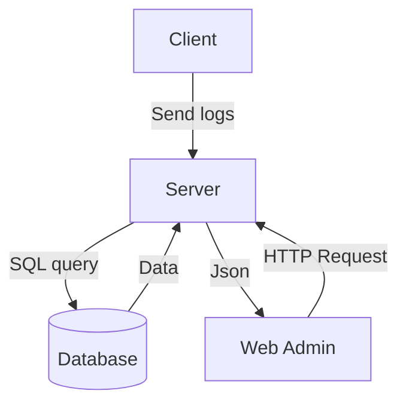
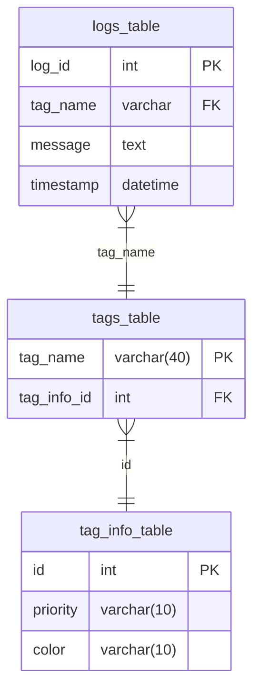

## Log Server

A simple local logging system with tag-based filtering,
designed to help with debugging Android application during manual testing.

## System Design

```mermaid
    graph TD
    A[Client] -->|Send logs| B[Server]
    B -->|SQL query| C[(Database)]
    C -->|Data| B
    B -->|Json| D[Web Admin]
    D --> |HTTP Request| B
```

## Database scheme

```mermaid
    erDiagram
    tag_info_table {
        id int PK
        priority varchar(10)
        color varchar(10)
    }
    
    tags_table }|--|| tag_info_table : id
    tags_table {
        tag_name varchar(40) PK
        tag_info_id int FK
    }
    logs_table }|--|| tags_table : tag_name
    logs_table {
        log_id int PK
        tag_name varchar FK
        message text
        timestamp datetime
    }
```